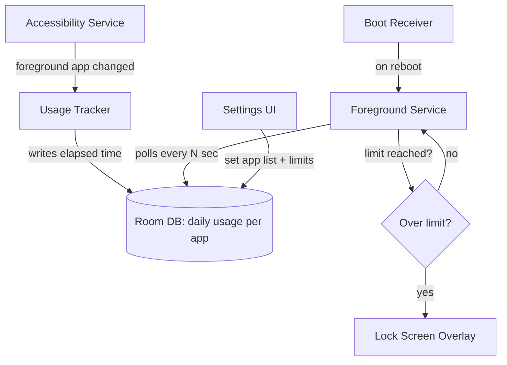

# App Blocker — Technical Architecture (Draft v1)

**Goal:** Set per-app daily time limits; once hit, app is locked with no in-app bypass.
**Strategy:** Android-native MVP first (testable on your S24U) → iOS native module → shared cross-platform layer.

---

## Phase 1: Android Native MVP

**Stack:** Kotlin, Jetpack Compose, Room (local DB)

### Required permissions/APIs
| Permission | Purpose |
|---|---|
| `PACKAGE_USAGE_STATS` (Usage Access) | Read per-app usage time |
| Accessibility Service | Detect foreground app in real time |
| `SYSTEM_ALERT_WINDOW` (Overlay) | Draw the lock screen over the blocked app |
| Foreground Service | Keep the monitor alive in background |
| `RECEIVE_BOOT_COMPLETED` | Restart monitoring after reboot |
| Battery optimization exemption | Prevent Doze/App Standby from killing the service |

### Core components

1. **Accessibility Service** — detects which app is in the foreground (`onAccessibilityEvent` on window state changes). This is the real-time trigger; `UsageStatsManager` alone is too laggy/batched for instant locking.
2. **Foreground Service** — runs continuously, ticks a timer while a tracked app is foregrounded, writes elapsed seconds to Room DB, checks against the daily limit.
3. **Room DB** — stores: tracked apps, daily limit per app, seconds used today, last-reset date (resets at midnight via a scheduled check, not a fixed alarm — avoid relying on `AlarmManager` alone since Doze can delay it).
4. **Lock Screen** — a full-screen `Activity` (not just an overlay) launched the instant the limit is hit, styled to sit on top of the blocked app. Overlay window as backup for edge cases where activity launch is delayed.
5. **Boot Receiver** — restarts the Foreground Service after device reboot.

### The "no bypass" reality check
Android gives you *most* of the way there, not all of it:
- User can revoke Accessibility permission from Settings → your service dies. You can detect this (permission-check on app open) and show a warning, but can't prevent it.
- User can force-stop the app from Settings → App Info. Detectable on next Accessibility trigger, but not preventable without Device Owner/MDM-level control (not realistic for a consumer app).
- Realistic goal: **make bypass require deliberate, multi-step effort** (leaving your app, going into system settings, confirming a warning dialog) — that friction is what actually reduces doomscrolling, even without literal unbreakability.

---

## Phase 2: iOS Native Module (Swift)

Frameworks: `FamilyControls` (auth) + `ManagedSettings` (shield/block) + `DeviceActivity` (scheduling).
Same conceptual pieces as Android, different APIs — plus the known limitation flagged earlier (user can revoke Screen Time permission for your app without the Screen Time passcode).

Build this only after Phase 1 is working and understood — you can't test it live without an iOS device anyway.

---

## Phase 3: Cross-Platform Shell

Once both native blocking engines exist, wrap them:

| Shared (one codebase) | Native (per platform) |
|---|---|
| Onboarding | Accessibility/FamilyControls permission flow |
| App picker UI | Foreground/background monitoring |
| Stats dashboard | Lock screen enforcement |
| Settings | — |
| Subscription/paywall | — |

**Recommended bridge:** Kotlin Multiplatform (`expect`/`actual`) — since your blocking logic is inherently native anyway, KMP's philosophy (native UI, shared business logic) fits better than Flutter/RN forcing everything through a plugin bridge. Flutter is a fine alternative if you'd rather have one shared UI layer and don't mind writing platform channel glue code.

---

## Suggested build order
1. Accessibility Service that just logs foreground app changes (prove detection works)
2. Add Room DB + per-app timer logic
3. Add lock screen Activity triggered on limit breach
4. Add Settings UI to pick apps + set limits
5. Add boot persistence + battery optimization handling
6. Polish, dogfood on your S24U for a few weeks
7. Then decide: iOS native module, or stay Android-only longer